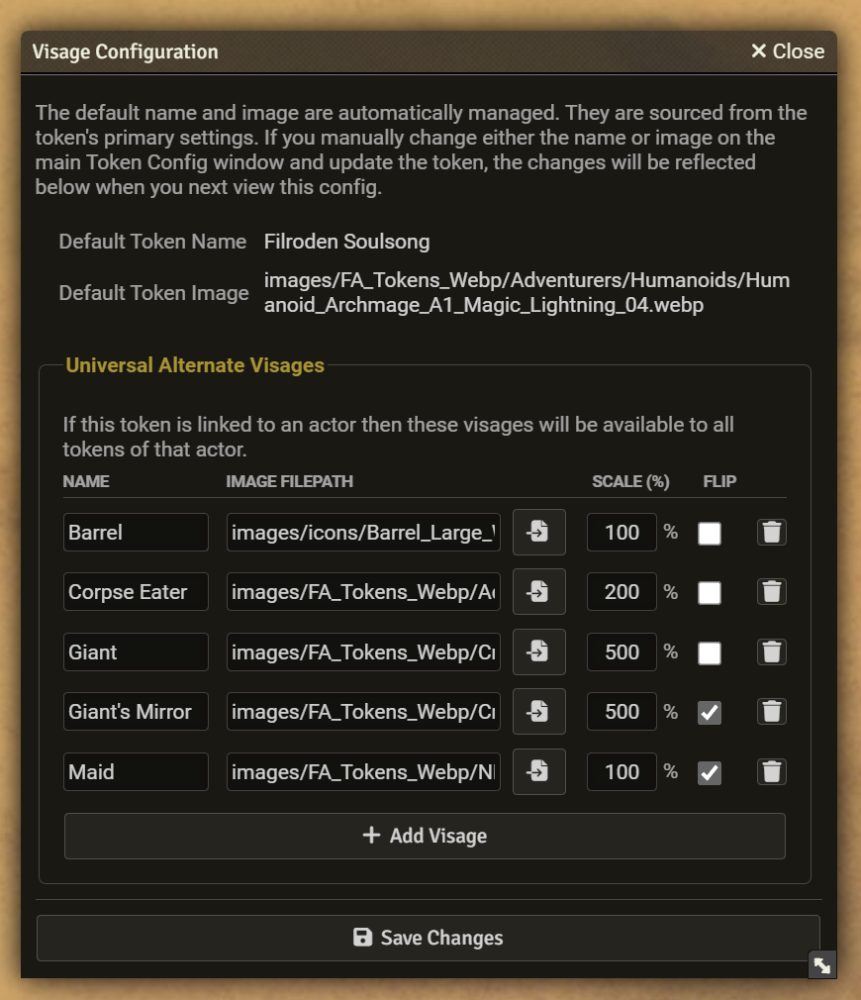
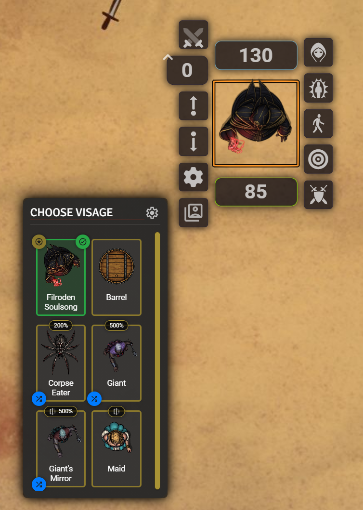

# Visage
Allows the owner of an Actor to instantly switch a Token's image and name between multiple pre-defined visages via a custom, grid-based selector in the Token HUD.

Software and associated documentation files in this repository are covered by an [MIT License](LICENSE.md).

| Version | Changes |
| :--- | :--- |
| **Version 0.3.2** | Fix bug when restoring scale to default |
| **Version 0.3.1** | Fix label in configuration tab |
| **Version 0.3.0** | Add a token image scaling feature, including option to flip the image |
| **Version 0.2.4** | *  Add module setting to remove visage data from tokens<br>*  Add star icon to default token tile in selector HUD<br>*  Add usage instructions to the README.md |
| **Version 0.2.3** | *  Under the covers code improvement<br>*  Improvements made to visage token configuration |
| **Version 0.2.1** | Fix issue with reading data from tokens that were not linked to actors |
| **Version 0.2.0** | Initial build |


# How to Use Visage

Visage makes it easy to switch a token's appearance and name on the fly. Here’s how to set it up and use it.

## 1. Configuring Visages

Before you can switch visages, you need to define them for an actor.

1.  **Open Token Configuration**: Right-click on a token and choose the cog icon to open the Token Configuration window.
2.  **Navigate to the Visages Tab**: Inside the configuration window, you will find a new "Visages" tab. Click on it.
3.  **Set Token Defaults**:
    *   The "Visages" tab shows the token's default name and image path. These are the settings the token will have when its visage is set to "Default".
    *   By default, these are inherited from the actor's main settings. However, you can override them by changing the token name on the "Identity" tab or the token image on the "Appearance" tab.
4.  **Add Alternate Visages**:
    *   Click the "**Add Visage**" button to create a new alternate form.
    *   For each alternate visage, you must provide:
        *   **Name**: A name for the visage (e.g., "Wolf Form", "Disguised", "Wounded", "Barrel"). This name will also be used for the token's name when this visage is active so remember this is what other players will see.
        *   **Image Path**: The path to the image file for this visage. You can use the folder icon to open the File Picker. Wildcards (`*`) are supported to select a random image from a folder.
        *   **Scale**: A numerical scale factor (e.g., `1.0`, `0.8`, `1.5`). This will visually enlarge or shrink the token image on the canvas without changing its actual grid size. The default is `1.0` (no change).
    *   These alternate visages are stored on the actor and are available to all tokens of that actor.
5.  **Delete Alternative Visages**: Click the trash can next to the alternative visage you want to delete.



## 2. Selecting a Visage

Once configured, switching between visages is simple.

1.  **Open the Token HUD**: Click on a token you have configured to bring up the Token HUD.
2.  **Click the Visage Icon**: You will see a new icon (typically a "switch account" symbol). Click this to open the Visage Selector.
3.  **Choose a Visage**: A grid will appear next to the token showing all the available visages you configured, including the token's specific "Default" look. The currently active visage will be highlighted.
4.  **Click to Switch**: Simply click on any of the images in the grid. The token's image and name will instantly update to match your selection, and the selector will close.



## 3. Restoring the Default

To switch a token back to its original appearance:

1.  Open the Visage Selector from the Token HUD.
2.  Click on the Default tile (marked with a gold star in the top left corner).
3.  The token will revert to the default name and image that you defined in the "Visages" tab of the Token Configuration.

## 4. Deleting all visage-related date

For GMs, the module offers two settings that will remove all visage-related data from either all tokens on a scene or from all tokens on all scenes. Use this with caution as it cannot be undone.


# Visage Module: Public API Documentation

The **Visage** module exposes a public API that allows other modules, system macros, or advanced users to programmatically interact with its core functionality, such as switching actor forms.

The API is accessible via `game.modules.get('visage').api`.

-----

## Accessing the API

To access any of the functions described below, you must first get a reference to the API object:

```javascript
const visageAPI = game.modules.get('visage')?.api;

if (!visageAPI) {
    console.error("Visage API is not available.");
    return;
}
// Now you can call the functions, e.g., visageAPI.setVisage(...)
```

-----

## API Methods

### 1\. setVisage

The core function to switch the specified Token to the specified form.

| Parameter | Type | Description |
| :--- | :--- | :--- |
| `actorId` | `string` | The ID of the Actor document to update. |
| `tokenId` | `string` | The ID of a specific Token on the canvas to update immediately. |
| `formKey` | `string` | The key of the form to switch to. Use the string literal `"default"` to switch to the Token's default image, name and scale. |

**Signature:**

```typescript
(actorId: string, tokenId: string, formKey: string): Promise<boolean>
```

**Returns:**

  * `Promise<true>` on success.
  * `Promise<false>` if the Actor, Token, or the specified `formKey` is not found.

**Example: Switch a specific token to a 'Wolf' form**

```javascript
visageAPI.setVisage("actor-id-12345", "token-id-67890", "Wolf");
```

### 2\. getForms

Retrieves a standardized array of all available alternate visages for a given Actor.

| Parameter | Type | Description |
| :--- | :--- | :--- |
| `actorId` | `string` | The ID of the Actor document. |

**Signature:**

```typescript
(actorId: string): Array<object> | null
```

**Returns:**

*   An `Array` of visage objects, where each object has the following structure:
    *   `key` (string): The internal key for the visage.
    *   `name` (string): The display name of the visage.
    *   `path` (string): The image file path for the visage.
    *   `scale` (number): The configured scale for the visage (defaults to `1.0`).
*   Returns `null` if no forms are defined or the Actor is not found.

**Example:**

```javascript
const forms = visageAPI.getForms("actor-id-12345");
// forms might look like:
// [
//   { key: "Wolf", name: "Wolf", path: "path/to/wolf.webp", scale: 1.2 },
//   { key: "Disguise", name: "Disguise", path: "path/to/mask.webp", scale: 1.0 }
// ]
```

### 3\. isFormActive

Checks if the specified form is currently active on a specific Token.

| Parameter | Type | Description |
| :--- | :--- | :--- |
| `actorId` | `string` | The ID of the Actor document. |
| `tokenId` | `string` | The ID of the token to check. |
| `formKey` | `string` | The key of the form to check (e.g., `"default"`, `"Wolf"`). |

**Signature:**

```typescript
(actorId: string, tokenId: string, formKey: string): boolean
```

**Returns:**

  * `true` if the token's current form key matches the one provided, otherwise `false`.

**Example:**

```javascript
if (visageAPI.isFormActive("actor-id-12345", "token-id-67890", "default")) {
    console.log("The token is in its default form.");
}
```

### 4\. resolvePath

A utility function to resolve a file path that may contain a Foundry VTT wildcard (`*`) into a single, concrete image path. This is primarily used for displaying a single image in UI previews.

| Parameter | Type | Description |
| :--- | :--- | :--- |
| `path` | `string` | The file path (which may include a wildcard). |

**Signature:**

```typescript
(path: string): Promise<string>
```

**Returns:**

  * A `Promise` that resolves to the concrete file path. If the path does not contain a wildcard, the original path is returned.

**Example:**

```javascript
const wildcardPath = "path/to/images/*.webp";
const resolved = await visageAPI.resolvePath(wildcardPath);
// resolved might be: "path/to/images/wolf-03.webp"
```

-----

## Note on Token vs. Actor IDs

The Visage API methods require both an `actorId` and a `tokenId` because the custom visage configurations are stored on the **Actor Document**, but the visual changes must be applied to the specific **Token Document** on the canvas.

To call these functions, you must first retrieve the `actorId` from the Token. In Foundry VTT, every Token on the canvas — even those **unlinked** from a source actor — has an embedded or temporary Actor Document accessible via the Token's API.

You can reliably get both IDs from any selected Token instance (`token`) on the canvas using:

```javascript
const tokenId = token.id;
const actorId = token.actor.id; // Works for both linked and unlinked tokens
```

-----

## Deprecation Notice

**Upcoming Data Model Change:**

In a future major version (tentatively v0.4.0), the internal data model for identifying visages will be updated. Currently, visages are keyed by their human-readable name (e.g., `"Wolf Form"`). This will be replaced by a stable, randomly generated **UUID** for each visage.

**Reason for Change:** Using the visage name as a key is brittle; if a user renames a visage, it breaks any integrations that rely on that name. A stable UUID ensures that a visage can be reliably referenced even if its name changes.

**Impact:**

*   The `key` property in the objects returned by `getForms` will be a UUID.
*   The `setVisage` function will require this UUID as the `formKey`.

Modules or macros integrating with Visage should prepare for this change. While the current name-based system will be supported for a transition period, relying on the stable `key` property for future compatibility is strongly recommended.
